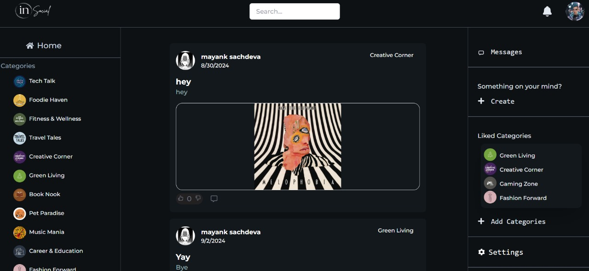
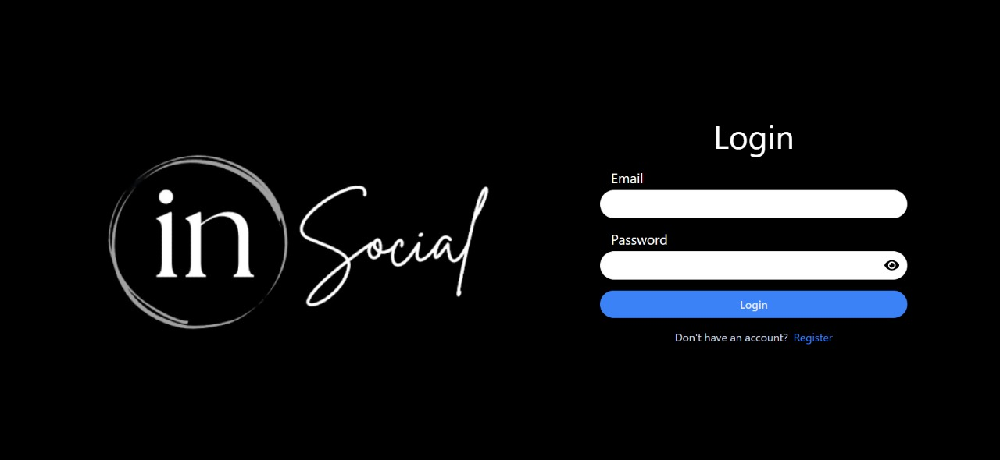
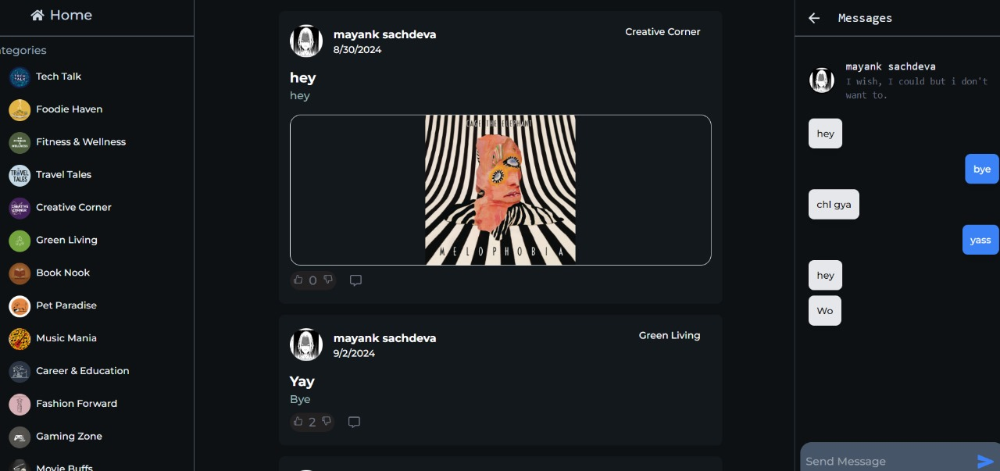
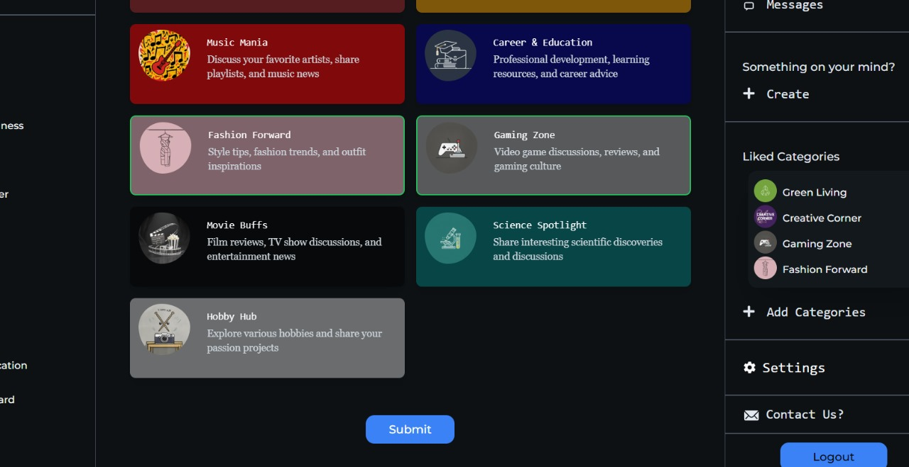

#  
# [inSocial.tech](https://www.insocial.tech)

**inSocial.tech** is a dynamic social networking platform designed to foster connections and interactions among users in an engaging online environment. The website offers a variety of features that allow users to create and share posts, engage with content from others, and explore new interests.

## Table of Contents
- [Introduction](#introduction)
- [Features](#features)
- [Installation](#installation)
- [Usage](#usage)
- [Dependencies](#dependencies-tech-stacks)
- [Contributing](#contributing)
- [Overwiew](#overview)
- [License](#license)
- [Contact](#contact)

## Introduction

**inSocial.tech** is a social platform where users can express themselves, interact with others, and discover new content based on their interests. Whether you want to share your thoughts, connect with friends, or explore trending topics, inSocial.tech provides a space for it all.

Join **inSocial.tech** today to start sharing, connecting, and exploring content that resonates with you!

## Features

**inSocial.tech** offers a wide range of features designed to enhance user interaction and engagement:

- **Post Creation**: Share your thoughts, photos, or videos with your friends and followers.
- **Like and Comment**: Engage with posts by liking and commenting on them to join the conversation.
- **Messaging**: Communicate privately with other users through a built-in messaging system.
- **Notifications**: Stay updated with notifications when someone likes or comments on your posts.
- **Explore by Categories**: Discover content tailored to your interests by liking specific categories or genres.
- **Profile Customization**: Update your profile with a custom avatar, cover image, and personal information to reflect your unique identity.
- **Real-Time Updates**: Receive real-time updates for messages and new content.

## Installation

To get a local copy of **inSocial.tech** up and running, follow these simple steps:

## clone or download
```terminal
$ git clone https://github.com/your-username/WhisperHub.git
$ npm i
```
## project structure
```terminal
LICENSE
package.json
backend/
   package.json
   .env (to create .env, check [prepare your secret session])
frontend/
   package.json
...
```
# Usage 

## Prerequisites
- [MongoDB](https://gist.github.com/nrollr/9f523ae17ecdbb50311980503409aeb3)
- [Node](https://nodejs.org/en/download/) ^10.0.0
- [npm](https://nodejs.org/en/download/package-manager/)

notice, you need client and server runs concurrently in different terminal session, in order to make them talk to each other

## Client-side usage(PORT: 5173)
```terminal
$ cd frontend   // go to frontend folder
$ npm i       // npm install packages
$ npm run dev // run it locally

```

## Server-side usage(PORT: 8000)

### Start

```terminal
$ cd backend   // go to backend folder
$ npm i       // npm install packages
$ npm run start // run it locally
```
### Dependencies (Tech Stacks)

**Client-side** | **Server-side**
--- | ---
`@google/generative-ai: ^0.17.1` | `bcrypt: ^5.1.1`
`@huggingface/inference: ^2.8.0` | `bcryptjs: ^2.4.3`
`@reduxjs/toolkit: ^2.2.6` | `cloudinary: ^2.2.0`
`axios: ^1.7.2` | `cookie-parser: ^1.4.6`
`events: ^3.3.0` | `cors: ^2.8.5`
`fs: ^0.0.1-security` | `dotenv: ^16.4.5`
`js-cookie: ^3.0.5` | `express: ^4.19.2`
`react: ^18.3.1` | `express-session: ^1.18.0`
`react-chat-elements: ^12.0.15` | `js-cookie: ^3.0.5`
`react-dom: ^18.2.0` | `jsonwebtoken: ^9.0.2`
`react-dropzone: ^14.2.3` | `mongodb: ^6.6.2`
`react-easy-crop: ^5.0.7` | `mongoose: ^8.3.5`
`react-hot-toast: ^2.4.1` | `multer: ^1.4.5-lts.1`
`react-icons: ^5.2.1` | `nodemailer: ^6.9.14`
`react-image-crop: ^11.0.6` | `otp-generator: ^4.0.1`
`react-notifications: ^1.7.4` | `passport: ^0.7.0`
`react-otp-input: ^3.1.1` | `passport-discord: ^0.1.4`
`react-redux: ^9.1.2` | `passport-google-oauth20: ^2.0.0`
`react-router-dom: ^6.24.1` | `passport-oauth2: ^1.8.0`
`react-spinners: ^0.14.1` | `socket.io: ^4.7.5`
`react-tweet: ^3.2.1` |
`redux: ^5.0.1` |
`redux-persist: ^6.0.0` |
`socket.io-client: ^4.7.5` |
`universal-cookie: ^7.2.0` |

**Dev Dependencies (Client-side)** | **Dev Dependencies (Server-side)**
--- | ---
`@types/react: ^18.3.3` | `nodemon: ^3.1.0`
`@types/react-dom: ^18.3.0` |
`@vitejs/plugin-react: ^4.3.1` |
`autoprefixer: ^10.4.19` |
`eslint: ^8.57.0` |
`eslint-plugin-react: ^7.34.2` |
`eslint-plugin-react-hooks: ^4.6.2` |
`eslint-plugin-react-refresh: ^0.4.7` |
`postcss: ^8.4.39` |
`tailwindcss: ^3.4.4` |
`vite: ^5.3.1` |

## Contributing

We welcome contributions to **inSocial.tech**! Whether you're fixing bugs, improving documentation, adding new features, or enhancing existing ones, your help is greatly appreciated.

### How to Contribute

1. **Fork the Repository**: Click the "Fork" button at the top of this repository to create a copy of the project on your GitHub account.

2. **Clone Your Fork**: Clone your forked repository to your local machine using the following command:

    ```terminal
    $ git clone https://github.com/your-username/WhisperHub.git
    ```

3. **Create a New Branch**: Create a new branch for your feature, bug fix, or other work.

    ```terminal
    $ git checkout -b your-branch-name
    ```

4. **Make Your Changes**: Make the necessary changes in your local repository.

5. **Commit Your Changes**: After making changes, stage and commit your work.

    ```terminal
    $ git add .
    $ git commit -m "Description of the changes you made"
    ```

6. **Push to Your Fork**: Push the changes to your forked repository.

    ```terminal
    $ git push origin your-branch-name
    ```

7. **Submit a Pull Request**: Go to the original repository on GitHub, and submit a pull request to the `main` branch. Describe your changes and why they should be merged.

8. **Review Process**: Your pull request will be reviewed by the maintainers. If any changes are requested, make them and push the updates to your branch. Once everything is approved, your contribution will be merged.

### Contribution Guidelines

- **Code Style**: Ensure that your code adheres to the existing style guidelines. Run the linters and formatters provided in the project before submitting your changes.
- **Testing**: Please write tests for any new features or bug fixes and ensure that all existing tests pass.
- **Documentation**: Update documentation if your changes affect any existing features or add new ones.
- **Commit Messages**: Use clear and descriptive commit messages for better understanding and tracking of changes.

Thank you for contributing to **inSocial.tech** and helping to make it better for everyone!

# Overview

User visit public and Home page


User can sign in or sign up


After signing in user can use messaging functionality


User can add his liked categories


# Contact

contact us at email:
! rbh97995@gmail.com
! msachdeva9april@gmail.com