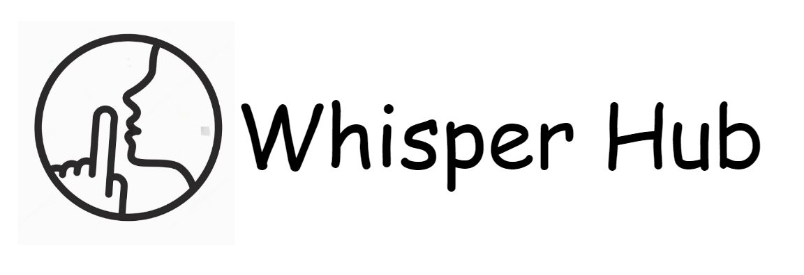

#  [inSocial.tech](https://www.insocial.tech)

**inSocial.tech** is a dynamic social networking platform designed to foster connections and interactions among users in an engaging online environment. The website offers a variety of features that allow users to create and share posts, engage with content from others, and explore new interests.

## Table of Contents
- [Introduction](#introduction)
- [Features](#features)
- [Installation](#installation)
- [Usage](#usage)
- [Contributing](#contributing)
- [License](#license)
- [Contact](#contact)

## Introduction

**inSocial.tech** is a social platform where users can express themselves, interact with others, and discover new content based on their interests. Whether you want to share your thoughts, connect with friends, or explore trending topics, inSocial.tech provides a space for it all.

Join **inSocial.tech** today to start sharing, connecting, and exploring content that resonates with you!

## Features

**inSocial.tech** offers a wide range of features designed to enhance user interaction and engagement:

- **Post Creation**: Share your thoughts, photos, or videos with your friends and followers.
- **Like and Comment**: Engage with posts by liking and commenting on them to join the conversation.
- **Messaging**: Communicate privately with other users through a built-in messaging system.
- **Notifications**: Stay updated with notifications when someone likes or comments on your posts.
- **Explore by Categories**: Discover content tailored to your interests by liking specific categories or genres.
- **Profile Customization**: Update your profile with a custom avatar, cover image, and personal information to reflect your unique identity.
- **Real-Time Updates**: Receive real-time updates for messages and new content.

## Installation

To get a local copy of **inSocial.tech** up and running, follow these simple steps:

## clone or download
```terminal
$ git clone https://github.com/amazingandyyy/mern.git
$ npm i
```
## project structure
```terminal
LICENSE
package.json
server/
   package.json
   .env (to create .env, check [prepare your secret session])
client/
   package.json
...
```
# Usage (run fullstack app on your machine)

## Prerequisites
- [MongoDB](https://gist.github.com/nrollr/9f523ae17ecdbb50311980503409aeb3)
- [Node](https://nodejs.org/en/download/) ^10.0.0
- [npm](https://nodejs.org/en/download/package-manager/)

notice, you need client and server runs concurrently in different terminal session, in order to make them talk to each other

## Client-side usage(PORT: 5173)
```terminal
$ cd frontend   // go to frontend folder
$ npm i       // npm install packages
$ npm run dev // run it locally

```

## Server-side usage(PORT: 8000)

### Start

```terminal
$ cd backend   // go to backend folder
$ npm i       // npm install packages
$ npm run start // run it locally
```
